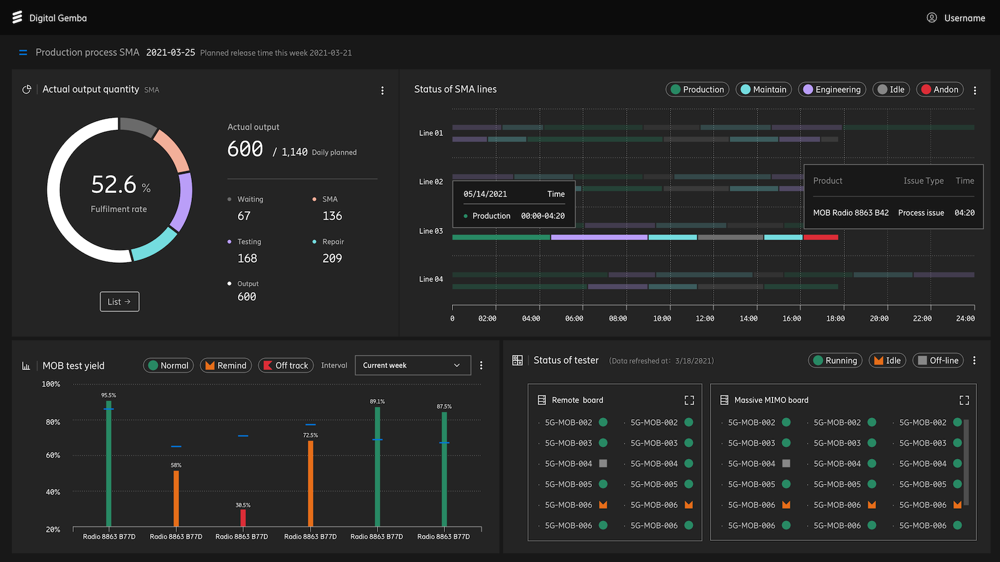
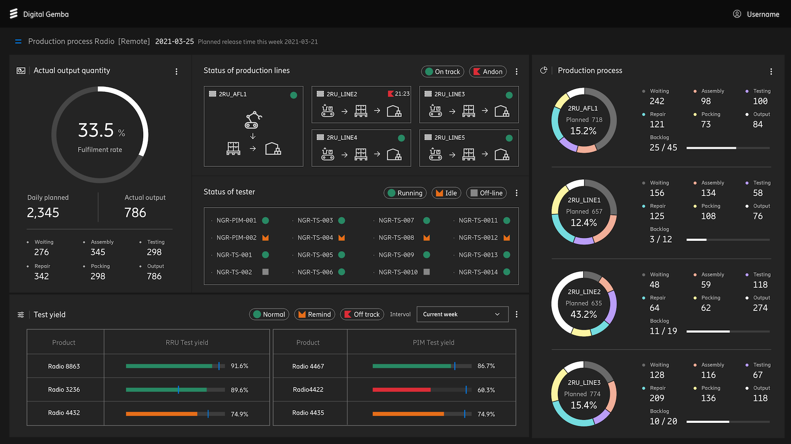

## Context

The strongest portfolio story is not a generic list of disconnected features. It is one product space where frontend architecture, backend orchestration, cloud integration, caching strategy, and AI-assisted workflows all had to work together without becoming fragile.

At Ericsson, the work spanned smart manufacturing interfaces, Digital Gemba delivery, office occupancy views, workplace service flows, and an internal assistant for workplace discovery. The constraint was not just shipping features. The real requirement was to ship useful interfaces that remained understandable, fast, and operable under real delivery pressure.

## What I owned

I owned module-level delivery across both UI and backend-facing concerns. That meant translating operational requirements into React product surfaces, shaping service boundaries in Node.js and Hono, working with Redis-backed data paths where latency mattered, and helping the system stay maintainable as feature scope expanded.

The recurring pattern was end-to-end ownership:

- define the UI structure and interaction model
- align the service contract with the product need
- make data loading predictable under real usage
- keep integrations understandable for the next engineer who has to touch them

## System shape

The application surface brought together several delivery modes instead of relying on one oversized backend.

- React and TypeScript handled the primary user-facing product flows.
- Node.js services and Hono endpoints supported task-specific orchestration.
- Redis improved response paths for live office occupancy and related high-read experiences.
- Azure-aligned infrastructure patterns supported secure integration boundaries and operational reliability.
- Background jobs pulled external data, normalized it, and fed downstream interfaces without forcing the UI to absorb integration complexity.

## Key problems solved

### 1. Making operational data feel usable

Manufacturing and workplace systems often fail in the interface layer first. The data may exist, but the experience becomes hard to scan, slow to navigate, or inconsistent across contexts. I focused on keeping the UI legible for actual users while still exposing the detail needed for operational work.

### 2. Preventing backend complexity from leaking everywhere

Where data came from multiple systems, the goal was not to mirror that complexity in the frontend. Sync jobs and service shaping made the product surface cleaner, reduced repeated transformation logic, and kept the UI closer to the user problem instead of the integration problem.

### 3. Using AI without turning the product into a black box

The workplace chatbot was valuable because it answered specific internal questions faster, not because it added novelty. The implementation stayed grounded in product usefulness and engineering clarity so the system remained supportable by the team.

## Why this case study matters

This project captures the work I am most valuable for:

- frontend architecture that stays maintainable as scope grows
- backend integration choices that reduce product friction
- caching and data-shaping decisions that protect user experience
- AI-assisted capabilities that improve workflows without destabilizing the system

It is the clearest example of senior full-stack engineering with real product context rather than isolated technical demos.

## Delivery outcomes

The strongest outcome was not a single metric claim. It was the combination of faster interfaces, clearer service boundaries, more predictable data flows, and a broader product surface that could keep growing without losing engineering shape.

That is the standard I optimize for in portfolio work and production teams alike: clear tradeoffs, resilient implementation, and product experiences that still feel fast when the system around them becomes more complex.
